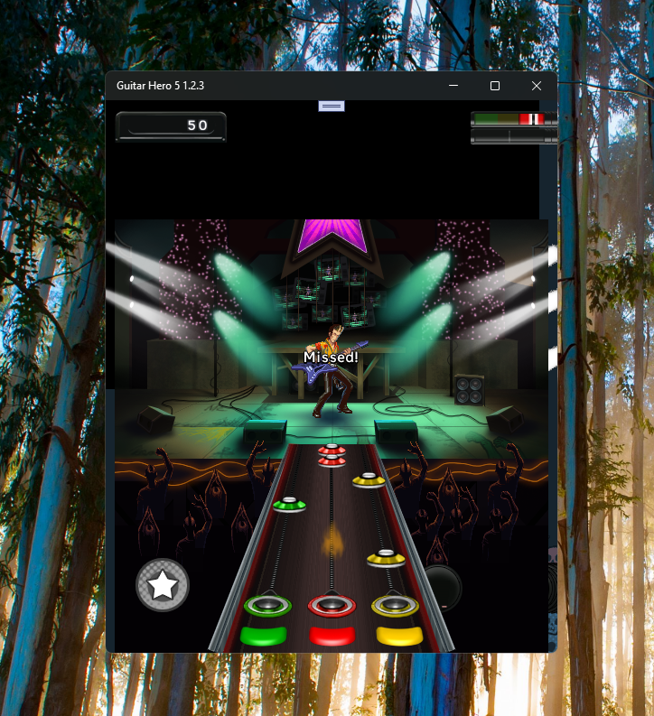
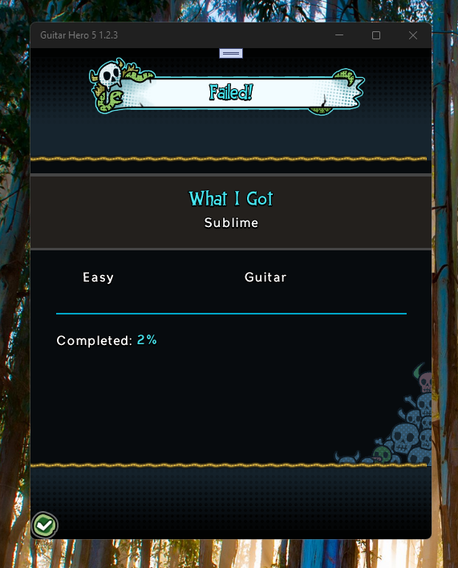

# GuitarHero5 1.2.3 - master branch 

This is my "UWP-Remake" of GuitarHero5 1.2 (xap), fun melogic educational game / project. Work-in-progress / not ready

## Preface
Guitar Hero 5 Mobile was indeed released on Windows Phone, specifically for Windows Phone 7, as the latest port of the game according to WikiHero. It was developed and published by Glu Mobile on October 21, 2010. This version combined the main game's setlist, bonus songs from BlackBerry and webOS versions, and most of the "More Music" edition songs, all at full length. 
Key Details about Guitar Hero 5 Mobile on Windows Phone:

The Windows Phone (XAP) version was the final iteration of the mobile Guitar Hero 5 game. 

### Setlist
It included songs from the original mobile release, bonus tracks from BlackBerry/webOS versions, and most of the "More Music" edition tracks. 

### Song Length
The songs were presented in their original audio and full length, unlike some other mobile versions with shortened MIDI tracks. 

## Screenshots

## My 2 cents
- GuitarHero5 1.2 (xap) decompiled by JetBrains DotPeek decompiler
- XAP -> UWP (4 blocks: com.glu.game, shared, binary, and resgen)
- Min. Win. SDK sett to 10240 
- Small Decompiler's bugfix
- Live Services patching (not ready yet) 

## TODO
- Fix 100500 possible bugs :)
- Add kbd / mouse game input
- Change "Mobile" label to "Universal"? ;)))

## Reference(s)
- https://4pda.to/forum/index.php?showtopic=214471 "Guitar Hero 5 | музыкальная игра" (4PDA, Rus.) 

## .
As is. No support. DIY. Learn purposes only.

## ..
[m][e] July, 18 2025
